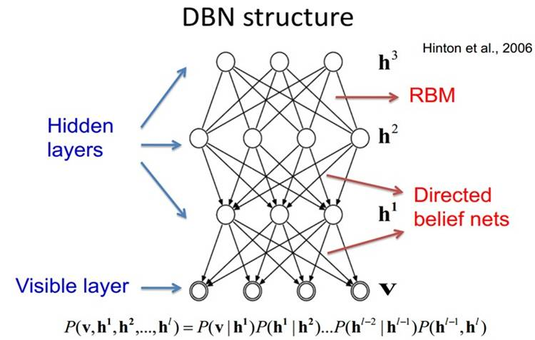
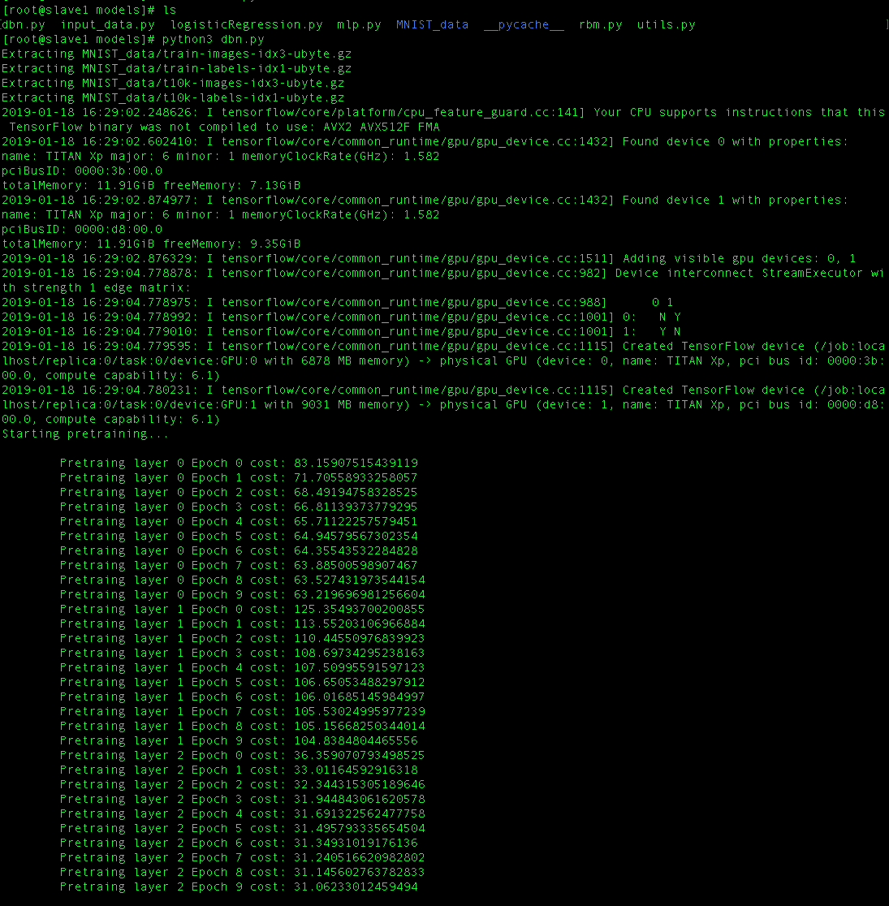
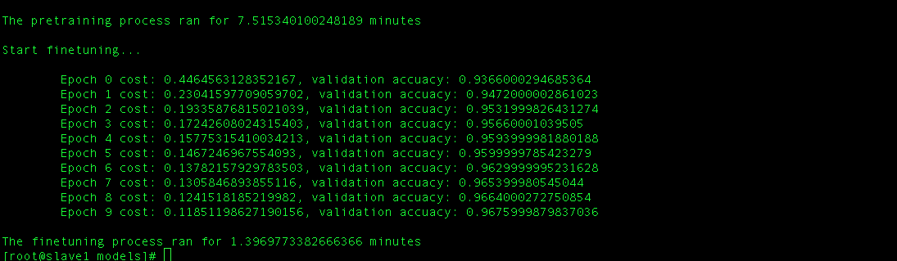

#README
@(深度置信网络DBN)[MLP|RBM|tensorflow]

-------------------

[TOC]

## 深度置信网络DBN简介

>深度置信网络是具有若干隐变量层的生成模型。隐单元通常是二值的，而可见单元可以是二值或实数。只有一个隐藏层的 DBN 只是一个 RBM。 
>DBNs是一个概率生成模型，与传统的判别模型的神经网络相对，生成模型是建立一个观察数据和标签之间的联合分布，对P(Observation|Label)和 P(Label|Observation)都做了评估，而判别模型仅仅而已评估了后者，也就是P(Label|Observation)。
>DBNs由多个限制玻尔兹曼机（Restricted Boltzmann Machines）层组成，一个典型的神经网络类型如图所示。这些网络被“限制”为一个可视层和一个隐层，层间存在连接，但层内的单元间不存在连接。隐层单元被训练去捕捉在可视层表现出来的高阶数据的相关性。
它的网络结构如下：

##项目简介
###运行环境
- python3.6
- tensorflow-gpu-1.12.0
###项目说明
本项目使用DBN识别手写字符mnist数据集。
传统的多层感知机或者神经网络的一个问题： 反向传播可能总是导致局部最小值。当误差表面(error surface)包含了多个凹槽，当你做梯度下降时，你找到的并不是最深的凹槽。而DBN却可以很好的解决这个问题。
深度置信网络可以通过额外的预训练规程解决**局部最小值**的问题。 预训练在反向传播之前做完，这样可以使错误率离最优的解不是那么远，也就是我们在最优解的附近。再通过反向传播慢慢地降低错误率。
**深度置信网络主要分成两部分。第一部分是多层玻尔兹曼感知机，用于预训练我们的网络。第二部分是前馈反向传播网络，这可以使RBM堆叠的网络更加精细化。**
###实验参数
在项目中选择了3层RBM网络作为hidden layer，size分别为[500,200,50]
input_size：784 output_size：10
在网络的tensor纬度变化为：
	RBM1: 784 => 500
	RBM2: 500 => 200
	RBM3: 200 => 50
	OUTPUT: 50 => 10
###代码结构
- 主函数：dbn.py 其中包括初始化函数init()用来初始化DBN网络；预训练函数pretrain()用来预训练DBN网络，尽可能地降低loss；微调函数finetuning()用来在预训练的基础上微调参数，以反向传播误差的方式降低loss学习权重，最终得到结果。
- 读取数据：input_data.py 用来下载和解析mnist数据集，同时进行预处理，得到想要的返回值。
- 逻辑回归函数：logisticRegression.py 提供DBN输出层的逻辑回归单元。
- 隐藏层函数：mlp.py 提供RBM所需要的隐藏层单元。
- RBM函数：rbm.py 提供DBN的隐藏层的RBM单元。

###实验结果

###结果分析
从上图可以看出：在pretrain阶段，3个隐藏层的loss都有一定程度的降低，layer1_loss : 83.16=>63.22，layer2_loss：125.35=>104.84 ，layer3_loss：36.36=>31.06 说明在无监督的预训练阶段，对于网络有一定的优化。而在预训练之后的finetuning阶段，loss的量级一下子就降低到0.44左右，并且在10次epoch训练之后降至最低0.11，准确率也达到了96.7%

